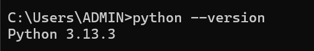
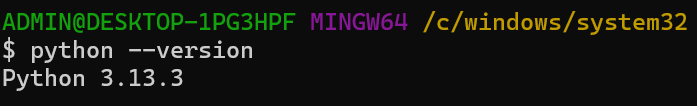
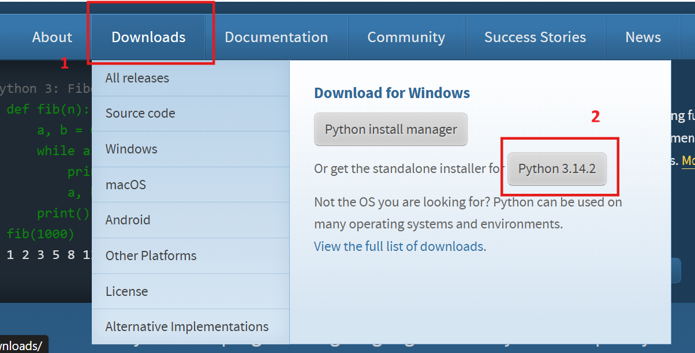
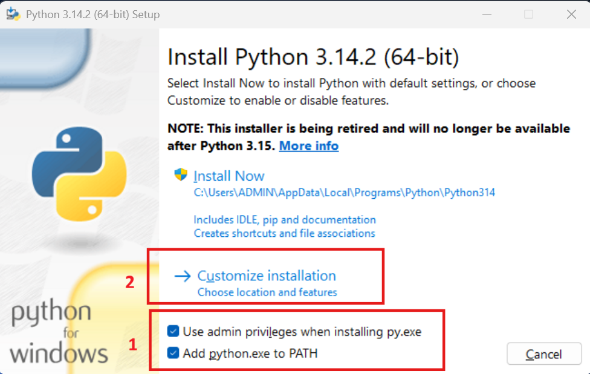
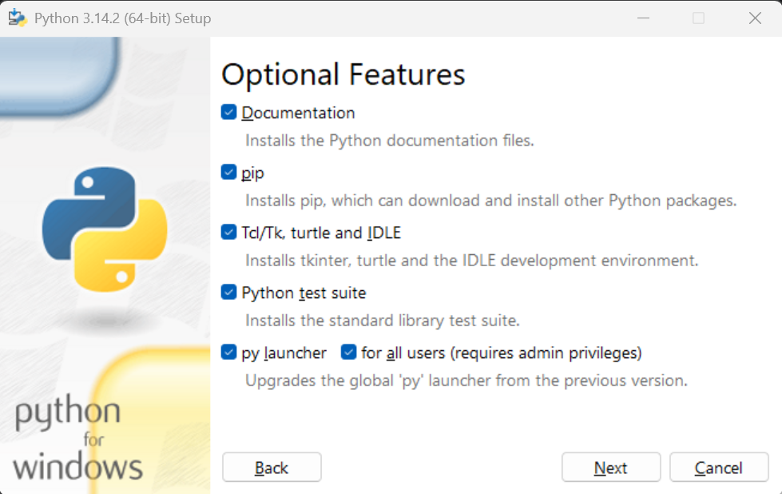
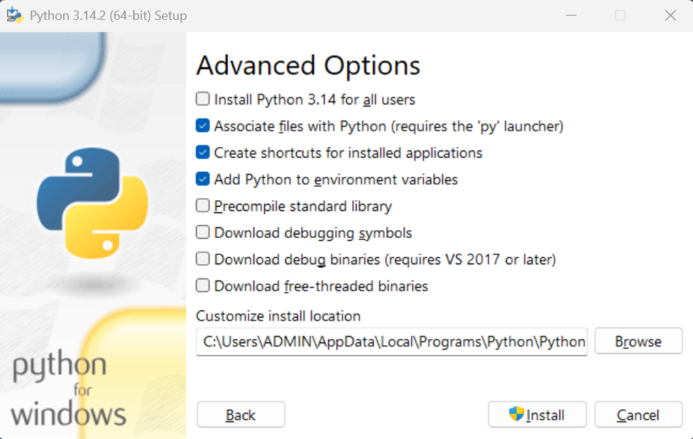
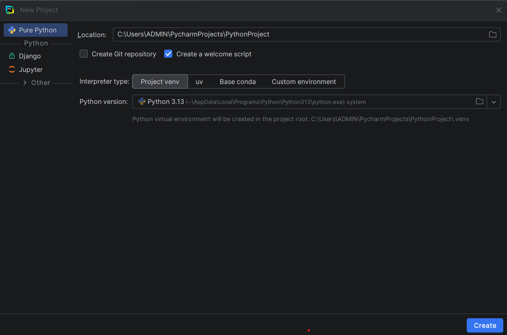
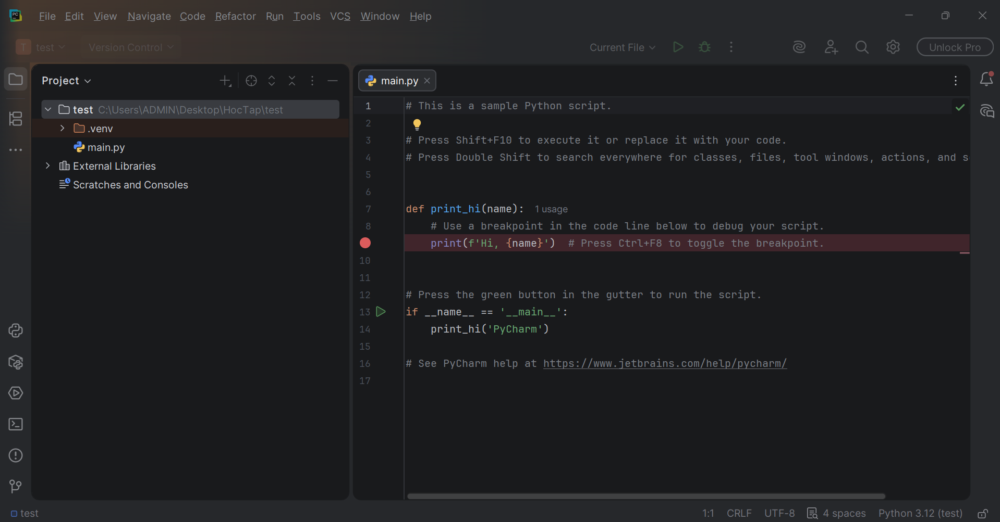
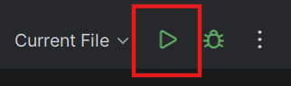
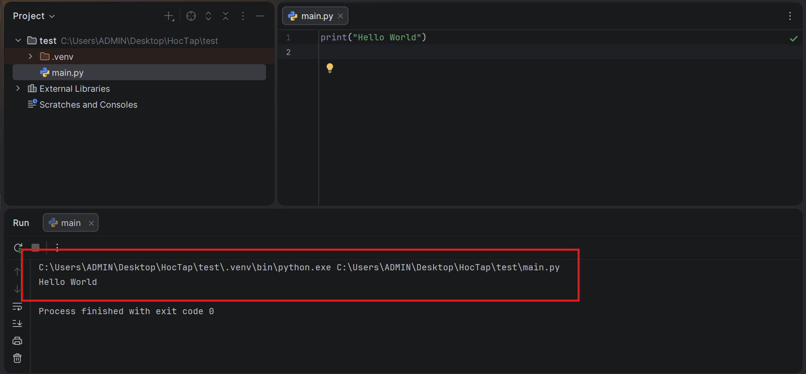

# Cách tải Pycharm và chạy chương trình python đầu tiên

## 1. Kiểm tra môi trường:

- Đầu tiên ta cần kiểm tra máy tính đã cài python chưa bằng cách gõ lệnh vào terminal:
  - Window/Linux: `python --version`
  - Kết quả ghi chạy câu lệnh
    - CLI: 
    - Git Bash: 
- Sau khi chạy cậu lệnh mà terminal không xuất hiên gì hết và trả lại dấu nhắc lệnh tức là bạn chưa tải python, còn nếu có rồi thì bạn có thể bỏ qua bước này
  - Truy cập vào đường link: https://www.python.org/downloads/ và nhấn vào nút trong ảnh
  - Open file vừa tải về, tích vào 2 checkbox trong ảnh và nhấn vào Customize installation
  - Đảm bảo các checkbox được chọn
  - Nếu trong máy tính có nhiều tài khoản thì chọn vào ô checkbox đầu tiên là nó sẽ cài python cho tất cả các user mà không sợ phải kiểm tra xem user đó đã có môi trường python chưa, bạn có thể không chọn nếu muốn và đường dẫn thì nên để mặc định, chọn install và đợi python cài đặt
  - Khi đã cài đặt xong thì gõ lại câu lệnh ở phía trên để kiểm tra thực sự python đã cài đặt thành công chưa

## 2. Cài đặt Pycharm:

- Truy cập vào link: https://www.jetbrains.com/pycharm/ để tải Pycharm về
- Mở file vừa tải vài cài đặt PyCharm, nhớ chọn vào ô creat desktop shortcut rồi cài đặt như bình thường thôi

## 3. Tạo dự án và chạy chương trình:

- Ở phía bên tay trái ta có thể chọn các kiểu dự án mà ta muốn tạo. Ở đây đang là code Python cơ bản nên tôi chọn **Pure Python**
- Phần Location là vị trí ta sẽ lưu dự án
- **Interpreter type** là loại môi trường sẽ tạo và quản lý trình thông dịch Python, ở đây có 4 loại
  - **Project venv**: Môi trường ảo của project (Recommend)
  - **uv (Ultra-fast environment & package manager)**: Là 1 công cụ mới thay thế các công cụ cũ như pip, venv,...
  - **Base conda**: Môi trường gốc của conda, sử dụng khi bạn có cài thêm Anaconda
  - **Custom environment**: Tùy chỉnh môi trường theo ý của bạn hay dự án
- **Python version**: Ta có thể chon version mà ta muốn sử dụng, thường thì Pycharm sẽ tự trỏ đến file Python mà bạn đã tải ở mục 1 nên không cần tùy chỉnh nếu bạn chưa quen
  
- Khi tạo xong thì PyCharm sẽ tạo 1 folder để biên dịch và quản lý các thư viện, file thứ 2 là file **main.py** là file mà bạn chạy đoạn code Python của mình (Nếu lúc tạo dự án mà bạn không tích vào ô 'Create a welcome script' thì file **main.py** sẽ không tự sinh ra)
- Ở đây tôi sẽ xóa nội dung file **main.py** và viết 1 đoạn code in ra dòng 'Hello world'
  - code: `print('Hello world')`
  - Bấm vào nút trong ảnh để chạy chương trình đầu tiên 
  - PyCharm sẽ hiện 1 terminal và hiện thị kết quả câu lệnh
